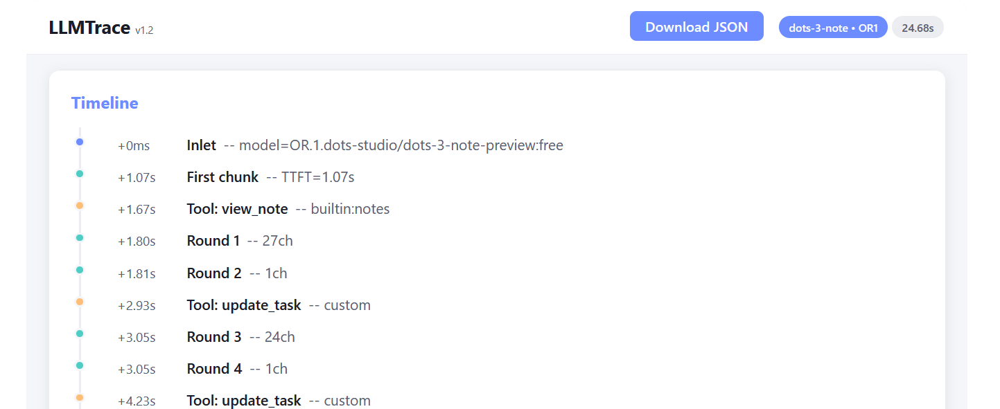

# <picture></picture> LLMTrace

**Part of the [FAI-Solutions Open WebUI Extensions hub](https://github.com/FAI-Solutions/open-webui-extensions)**

LLMTrace is an Open WebUI filter extension that traces and displays everything that happens between your message and the LLM's response (model selection, parameters, tool calls, reasoning blocks, streaming stats, and timing).

---

## Output Modes

The output is rendered as in-chat embeds **above** the LLM message and is not wrotten into the message text (basically the trace is invisible to the LLM).

| Mode | What you get |
|---|---|
| `timeline` | Compact timeline, rendered as an inline embed at the top of LLM message (default) |
| `dashboard` | Full Detailed Dashboard embed: timeline and cards with extra details |
| `both` | Timeline + Detailed Dashboard as two separate embeds |

 

### What It Shows

- **Request**: model ID, base model, function calling mode, vision capability, feature flags, parameters
- **System prompt**: detected length and preview
- **Conversation**: message depth and role breakdown
- **Attachments**: files and images in context
- **Tool calls**: name, category (builtin/custom/terminal), round-trip count
- **Reasoning**: tag-based or delta-based detection, block count, duration, character count
- **Streaming**: chunk count (content vs empty), finish reason, round tracking
- **Response quality**: characters, words, paragraphs, code blocks (with languages), headers, list items, tables, citations, math detection
- **Timing**: TTFT (time to first token), TTFC (time to first content), stream duration, total duration
- **RAG**: source detection and count

 

## Installation

### Step 0: Requirements

- Open WebUI 0.11.0 or newer

### Step 1: Download

- Download and Install from Open WebUI <a href="https://openwebui.com/posts/llmtrace_shows_the_llm_workflow_4dde62fe" rel="me noopener">Marketplace</a> (requires an account on Open WebUI). Open the URL and press the `GET` button and select the installation option that suits you best.

- Or download and Install from [Github](https://github.com/FAI-Solutions/open-webui-extensions/tree/main/llmtrace/llmtrace.json). Open the URL and press the download icon  in the top toolbar on the right side.

### Step 2: Install

1. Open WebUI Admin Panel → Functions → Create ▾  (press the dropdown arrow)
2. Pick Import JSON and select the downloaded json file
3. Enable the function
4. Click ⋯ and toggle Global on (lets you activate the filter with every model from the chat)

### Step 3: Usage

- Select the function in the chat and send your query to the LLM

 

## Settings Reference

**Admin Valves** (Admin Panel → Functions → LLMTrace → ⚙ gear icon):

| Valve | Default | Description |
|---|---|---|
| `priority` | `100` | Execution order (higher = later) |
| `enabled` | `true` | Master on/off |
| `emit_status` | `true` | Real-time status updates during streaming |
| `dashboard_mode` | `timeline` | Output mode (see table above) |
| `embed_initial_rows` | `12` | Timeline rows visible before "Show more" |
| `embed_expand_step` | `12` | Rows added per "Show more" click |
| `dash_timeline_rows` | `20` | Timeline rows shown in the Detailed Dashboard |

**User Valves** (accessible in the chat):

| Valve | Default | Description |
|---|---|---|
| `dashboard_mode` | `None` | Override admin output mode (`timeline` / `dashboard` / `both`) |

---

## Contact

- **Developer**: Johannes Faber — [fais.udder466@passinbox.com](mailto:fais.udder466@passinbox.com)
- **Hub-Website**: <a href="https://fai-solutions.github.io/" rel="me noopener">https://fai-solutions.github.io/</a>

## License

[MIT](../LICENSE)
