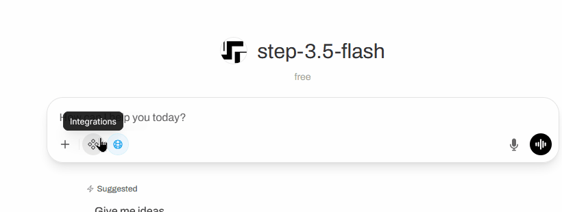
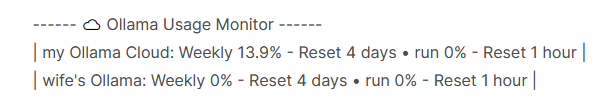

# Ollama Usage Monitor

Ollama Usage Monitor is an Open WebUI filter extension that shows Ollama Cloud usage stats at the end of each LLM response.



[](../assets/demo-ollama-usage-monitor.gif)

Back to [extensions overview](https://github.com/FAI-Solutions/open-webui-extensions) for Open WebUI by **FAI-Solutions**.

---

## Installation

### Step 1: Download and install

Download and Install from [openwebui-ollama-usage-monitor](https://openwebui.com/posts/4c6e3d6b-e65a-4c10-99a9-d9b4a75176c3).

### Step 2: Configuration

Activate the filter — **Ollama Usage Monitor**
```bash
1. Go to Profile → Admin Panel → Functions
2. Enable Ollama Usage Monitor
3. Click ••• (More) → Enable Global
# If you don’t know how to extract browser cookies, see the "One time setup" section.
# Once you have your JSON array ready continue with next step.
4. Open ⚙ (Valves) → set User Configs to Custom and paste your JSON array
5. Save your changes
```

### Step 3: Restart Open WebUI

Open a new chat window, click the ``Integrations`` icon next to the ``+``, and enable Ollama Usage Monitor. Send a simple message such as “Hi”. If the LLM response ends with:
```bash
------ ☁ Ollama Usage Monitor ------
```
the feature is active. If not, restart your Open WebUI server to ensure the filter is loaded (a restart was required in most of my tests).


## One time setup

### Ollama Website Login

1. Open a tab in your browser next to Open WebUI and navigate to [https://ollama.com/settings](https://ollama.com/settings)
2. Sign in using your Ollama account details

### Extract Cookies (example for Firefox)

> **Hint**: If you're using a different browser, paste these instructions into an LLM and ask it to adapt them to your browser.

3. Open **Developer Tools** (press `F12` or right-click → Inspect)
4. Navigate to the **Storage** tab in the top menu
5. Expand **Cookies** in the left side-bar
6. Click on `https://ollama.com`
7. Find and copy these cookie values into a text file:

| Cookie Name | Description | Mandatory |
|-------------|-------------| ----------|
| `__Secure-session` | Your session token | yes |
| `aid` | Account ID | yes |
| `cf_clearance` | Cloudflare clearance | yes if it exist; otherwise no |

> **Hint**: Double-click the cookie value to select it, then copy it.

### Create json format for User Configs

8. In the same file containing your cookie values, paste the code below: 
```json
[
  {
    "name": "MyAccount",
    "secure_session": "MyAccount_secure_session",
    "aid": "MyAccount_aid",
    "cf_clearance": "MyAccount_cf_clearance"
  }
]
```
9. Replace the place holder `MyAccount_secure_session`, `MyAccount_aid` and `MyAccount_cf_clearance` with your copied values (if ``cf_clearance`` is not available, leave it as an empty string "").
10. Then copy the JSON configuration and proceed to Step 2.4 of the Installation section.

> **Hint**: If the machine is shared or accessed over a local network, you can include multiple accounts. The format is as follows:

```json
[
  {
    "name": "Account1",
    "secure_session": "account1_secure_session",
    "aid": "account1_aid",
    "cf_clearance": "account1_cf_clearance"
  },
  {
    "name": "Account2",
    "secure_session": "account2_secure_session",
    "aid": "account2_aid",
    "cf_clearance": "account2_cf_clearance"
  }
]
```

## How to use

1. Start a new chat with any model
2. Enable **Ollama Usage Monitor** by clicking the `Integrations` icon next to the `+` symbol and toggling ``Ollama Usage Monitor`` on
3. Send your message to the LLM
4. After the response, you should see the usage statistics (see an example below):
```
------ ☁ Ollama Usage Monitor ------
| MyAccount: Weekly 29.3% - Reset 1 day • run 2.4% - Reset 5 hours |
```


## Settings Reference

| Setting | Default | Description |
|---------|---------|-------------|
| `user_configs` | `""` | JSON array of account configurations |
| `delay_seconds` | `0.5` | Seconds to wait before fetching stats (allows Ollama to update) |
| `enabled` | `true` | Enable or disable the filter globally |
| `debug_mode` | `false` | Enable debug logging to console |


## Troubleshooting

### Error: "Cloudflare challenge still active"

**Cause:** Cloudflare is blocking your request.

**Solution:**
1. Open ollama.com in your browser
2. Complete any Cloudflare challenges if prompted
3. Extract the new `cf_clearance` cookie
4. Update your configuration with the new value


### Error: "Some Python Library not available"

**Cause:** Open WebUI might remove a python package that is needed for this extension to work in a future update. Please inform me if that happens so that I can update the Install instructions.

**Solution:**
```bash
pip install package-name
```


### No output appears after messages

**Cause:** The filter may be disabled or no accounts configured.

**Solution:**
1. Check that `enabled` is set to `true`
2. Verify your `user_configs` contains valid JSON
3. Check Open WebUI logs for errors


### Cookie Expiration

**Cause:** Ollama cookies have a limited lifespan and will eventually expire.

**Solution:** Extract the cookies again and update them accordingly.

---

## License

[MIT](../LICENSE)


## Contact

- **Developer**: Johannes Faber — [fais.udder466@passinbox.com](mailto:fais.udder466@passinbox.com)
