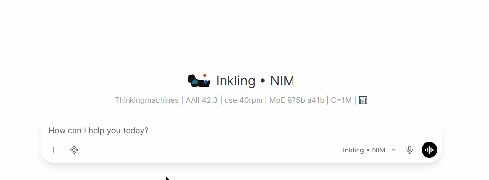

# <picture><source media="(prefers-color-scheme: dark)" srcset="../assets/ollama-dark.svg"><source media="(prefers-color-scheme: light)" srcset="../assets/ollama-light.svg"></picture>&thinsp;&thinsp;Ollama Usage Monitor

**Part of the [FAI-Solutions Open WebUI Extensions hub](https://github.com/FAI-Solutions/open-webui-extensions)**

Ollama Usage Monitor is an Open WebUI filter extension that shows session and weekly Ollama Cloud usage stats as a status line on each LLM response. Click the demo GIF below to see the Add-On in action:



---

## Installation

### Step 1: Download and install

- Download and Install from Open WebUI <a href="https://openwebui.com/posts/4c6e3d6b-e65a-4c10-99a9-d9b4a75176c3" rel="me noopener">Marketplace</a> (requires an account on Open WebUI). Open the URL and press the `GET` button and select the installation option that suits you best.
- Or download and Install from [Github](https://github.com/FAI-Solutions/open-webui-extensions/tree/main/ollama-usage-monitor/ollama_usage_monitor.json). Open the URL and press the download icon  in the top toolbar on the right side.
- In Open WebUI click your **Profile** → **Admin Panel** → **Functions** → click **Import** → select the file


### Step 2: Configuration

Activate the filter — **Ollama Usage Monitor**
```bash
1. Go to Profile → Admin Panel → Functions
2. Enable Ollama Usage Monitor
3. Click ••• (More) → Enable Global
# If you don’t know how to extract browser cookies, see the "One time setup" section.
# Once you have your JSON array ready continue with next step.
4. Open ⚙ (Valves) → set User Configs to Custom and paste your JSON array
5. Save your changes
```

### Step 3: Restart Open WebUI

Open a new chat window, click the ``Integrations`` icon next to the ``+``, and enable Ollama Usage Monitor. Send a simple message such as “Hi”. If the status line at the top of the LLM response is not shown restart Open WebUI server and try again.


## One time setup

### Ollama Website Login

1. Open a tab in your browser next to Open WebUI and navigate to [https://ollama.com/settings](https://ollama.com/settings)
2. Sign in using your Ollama account details

### Extract Cookies (example for Firefox)

> **Hint**: If you're using a different browser, paste these instructions into an LLM and ask it to adapt them to your browser.

3. Open **Developer Tools** (press `F12` or right-click → Inspect)
4. Navigate to the **Storage** tab in the top menu
5. Expand **Cookies** in the left side-bar
6. Click on `https://ollama.com`
7. Find and copy these cookie values into a text file:

| Cookie Name | Description | Mandatory |
|-------------|-------------| ----------|
| `__Secure-session` | Your session token | yes |
| `aid` | Account ID | yes |
| `cf_clearance` | Cloudflare clearance | yes if it exist; otherwise no |

> **Hint**: Double-click the cookie value to select it, then copy it.

### Create json format for User Configs

8. In the same file containing your cookie values, paste the code below: 
```json
[
  {
    "name": "MyAccount",
    "secure_session": "MyAccount_secure_session",
    "aid": "MyAccount_aid",
    "cf_clearance": "MyAccount_cf_clearance"
  }
]
```
9. Replace the place holder `MyAccount_secure_session`, `MyAccount_aid` and `MyAccount_cf_clearance` with your copied values (if ``cf_clearance`` is not available, leave it as an empty string ""). Feel free to rename `MyAccount` to what ever you want.
10. Then copy the JSON configuration and proceed to Step 2.4 of the Installation section.

> **Hint**: If the machine is shared or accessed over a local network, you can include multiple accounts. The format is as follows:

```json
[
  {
    "name": "Account1",
    "secure_session": "account1_secure_session",
    "aid": "account1_aid",
    "cf_clearance": "account1_cf_clearance"
  },
  {
    "name": "Account2",
    "secure_session": "account2_secure_session",
    "aid": "account2_aid",
    "cf_clearance": "account2_cf_clearance"
  }
]
```

## How to use

1. Start a new chat with any model
2. Enable **Ollama Usage Monitor** by clicking the `Integrations` icon next to the `+` symbol and toggling ``Ollama Usage Monitor`` on
3. Send your message to the LLM
4. After the response, the usage stats appear as a status line. Example with multiple accounts — click the collapsed row to expand:

   `☁ Ollama Usage Monitor`  →  expands to:
   ```
   ☁ MyAccount: Weekly 0% → Reset 4 days. • Session 0% → Reset 3 hours.
   ☁ WifesAccount: Weekly 0.4% → Reset 4 days. • Session 0% → Reset 3 hours.
   ```
   With a single account configured, the line is shown directly (no expansion):
   ```
   ☁ MyAccount: Weekly 29.3% → Reset 1 day. • Session 2.4% → Reset 5 hours.
   ```


## Settings Reference

| Setting | Default | Description |
|---------|---------|-------------|
| `user_configs` | `""` | JSON array of account configurations |
| `delay_seconds` | `0.5` | Seconds to wait before fetching stats (allows Ollama to update) |
| `enabled` | `true` | Enable or disable the filter globally |
| `debug_mode` | `false` | Enable debug logging to console |


## Version compatibility

| Open WebUI version | Ollama Usage Monitor version |
|--------------------|------------------------------|
| **v0.11 or newer** | [v0.7](https://github.com/FAI-Solutions/open-webui-extensions/tree/main/ollama-usage-monitor/ollama_usage_monitor.json) |
| v0.10 or older | [v0.6](https://github.com/FAI-Solutions/open-webui-extensions/tree/main/ollama-usage-monitor/ollama_usage_monitor-v0.6.json) |

Open WebUI v0.11.0 changed how filter-appended text is handled: content written into a message by a filter is now **persisted and sent back to the LLM** on subsequent turns. v0.7+ was rebuilt to deliver the stats as a **status line** instead of appended text, so the usage info is never visible to the LLM and leaves no residue in the chat when the filter is toggled off. v0.6 used the old append method, which only behaves correctly on pre-v0.11 Open WebUI.

### Detailed changes in v0.7

- **Stats now appear as a status line** above the response, not as appended text. With multiple accounts configured, a collapsed row `☁ Ollama Usage Monitor` expands to one row per account. With a single account, the stat line is shown directly.
- **Invisible to the LLM.** The stats live in the message's status history, never in its content, so they are not sent back to the model on later turns.
- **No residue when toggled.** Turning the filter off mid-chat stops new lines from appearing; nothing was ever written into the message text, so there is nothing left behind.
- **Improved debug mode** (`debug_mode` valve)


## Troubleshooting

### Error: "Cloudflare challenge still active"

**Cause:** Cloudflare is blocking your request.

**Solution:**
1. Open ollama.com in your browser
2. Complete any Cloudflare challenges if prompted
3. Extract the new `cf_clearance` cookie
4. Update your configuration with the new value
5. Update cloudscraper in the python venv / docker


### Error: "Some Python Library not available"

**Cause:** Open WebUI might remove a python package that is mandatory for the extension to work properly in a future update.

**Solution:** Please inform me, I will push an update — to fix the issue.


### No output appears after messages

**Cause:** The filter may be disabled, or no accounts are configured / values were pasted incorrectly

**Solution:**
1. Check that `enabled` is set to `true`
2. Verify your `user_configs` contains valid JSON
3. Check Open WebUI logs for errors (debug mode)


### Cookie Expiration

**Cause:** Ollama cookies have a limited lifespan and will eventually expire.

**Solution:** Extract the cookies again and update them accordingly.

---

## Contact

- **Developer**: Johannes Faber — [fais.udder466@passinbox.com](mailto:fais.udder466@passinbox.com)
- **Hub-Website**: <a href="https://fai-solutions.github.io/" rel="me noopener">https://fai-solutions.github.io/</a>


## License

[MIT](../LICENSE)
